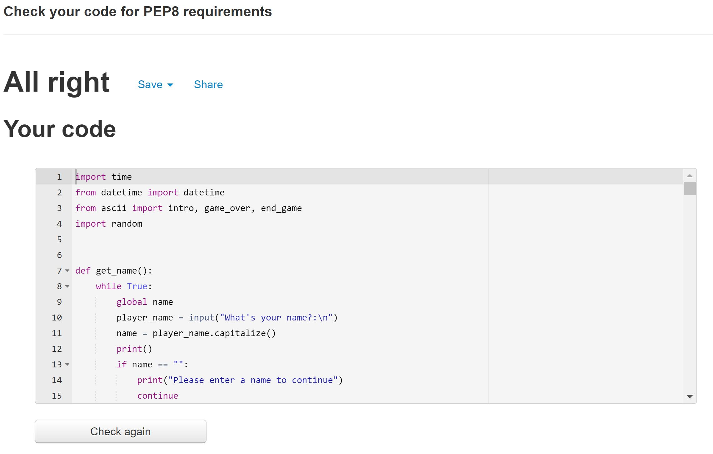

# Hellscape: Path of Maat

<a href=https://hellscape-path-of-maat.herokuapp.com>Live Site</a>

## Tabel of contents
<a href="#overview1">1) Intro</a> 
<a href="#tech">2) Technologies Used</a> 
<a href="#test1">3) Testing</a> 
<a href="#deployment">4) Deployment</a> 
<a href="#deployment">5) Bugs</a> 
<a href="#credit1">6) Credits</a> 

<h2 id="overview1">Intro</h2>

Hellscape, Path of Maat is a fictious interactive short novel of the religious horror/adventure genre played in a text based terminal.

<h3 id="overview4">How does it work?</h3>

The back end of Hellscape: Path of Maat was created with python. 
The logic chart can be viewed below: 

 
<h2 id="tech">Technologies Used</h2>
<h3 id="tech1">Languages Used</h3>
<ul>
<li>Python</li>
</ul>

<h3 id="tech2">Frameworks, Libraries and Programmes Used</h3> 
<ul>
<li><a href="https://www.heroku.com/" target="_blank">Heroku</a> - used for app deployment from Github</li>
<li><a href="https://github.com/" target="_blank">GitHub</a> - used to host repository.</li>
<li><a href="https://www.gitpod.io/" target="_blank">GitPod</a> - used to develop project and organise version control.</li>
<li><a href="https://docs.python.org/3/library/datetime.html#module-datetime" target="_blank">datetime</a> to get current date</li>
<li><a href="https://docs.python.org/3/library/random.html" target="_blank">random</a> to randomize anagram</li>
<li><a href="https://docs.python.org/3/library/time.html" target="_blank">time</a> - to slow down print statements</li>
</ul>

<h2 id="test1">Testing</h2>

<h3 id="test2">Lighthouse Testing</h3>
Majority of testing was done by myself using print statements. I also followed the path of the game down every possible combination to make sure I achieved desired output.  

 

<h3 id="test3">Validator Testing</h3>

Python was validated using [PEP8 online](http://pep8online.com/checkresult) to ensure code is pep8 compliant. 

 PEP8 online report
  

<h2 id="deployment">Deployment</h2>

The website was deployed to github pages through the following steps:
<ol>
<li>Once code is finished, enter <strong>pip3 freeze > requirements.txt.</strong> into gitpod terminal to import the required dependencies to the requirements.txt file</li>
<li>Once your code has been pushed to Github</li>
<li>Navigate to Github in the browser.</li>
<li>Sign in with user credentials.</li>
<li>Navigate to repositories.</li>
<li>Select the repository to deploy.</li>
<li>Copy name of the repository</li>
<li>Navigate to Heroku in the browser.</li>
<li>Sign in with user credentials.</li>
<li>Select <em>create new app</em> from drop down menu</li>
<li>Input unique app name and chose appropriate region</li>
<li>Select <em>create app</em></li>
<li>Under deployement method, select Github option</li>
<li>Paste repository name into search bar and <em>connect to repository</em></li>
<li>Navigate to settings</li>
<li>Select <em>add buildpack</em></li>
<li>Choose <strong>python</strong> and save</li>
<li>Repeat step 16 </li>
<li>Choose <strong>node.js</strong> and save, make sure Python is built before node.js</li>
<li>Navigate back to deploy</li>
<li>Select <em>manual deployment</em></li>
<li>Once finished</li>
<li>Click <em>open app</em></li>
<li>If the terminal is displaying correctly, navigate back to heroku deploy</li>
<li>Select <em>enable automatic deployment</em></li>

</ol>

<a href="https://www.heroku.com/" target="_blank">Heroku</a> will now deploy the site automatically and update any changes pushed to the Github repository main branch.
<h2 id="credit1">Credits</h2> 
<h3 id="credit2">Code</h3>
<ul>
<li>Most of the code was utilized from lessons given by the Code Institute</li>
<li>StackOverflow was used when problems were encountered</li>
<li>W3Schools was used as reference material</li>
</ul>
 
<h3 id="credit4">Acknowledgments</h3>
I would like to thank my mentor, my student advisor, the slack community and all tutor and support staff at Code Institute for their guidance and assistance in the making of this project. 
